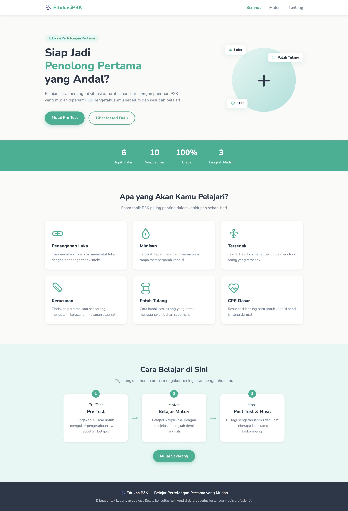
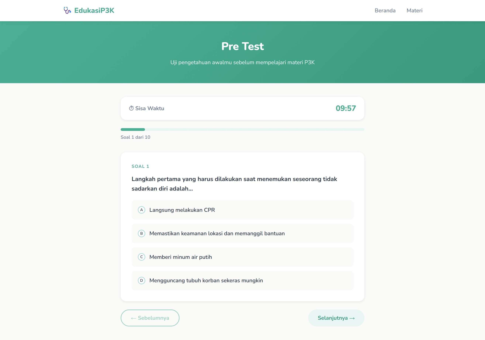
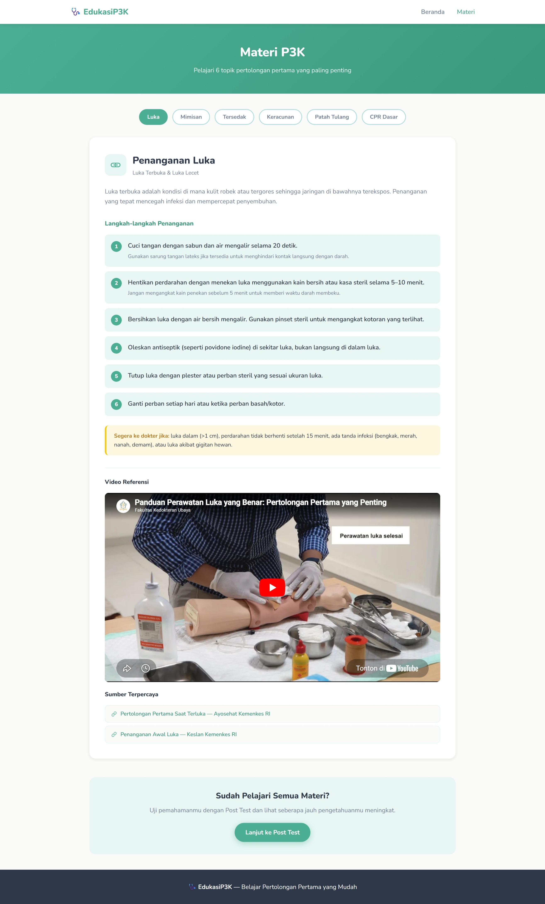
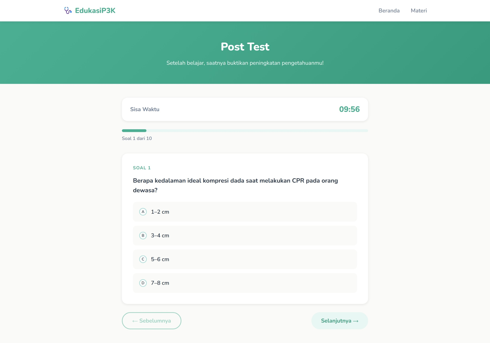
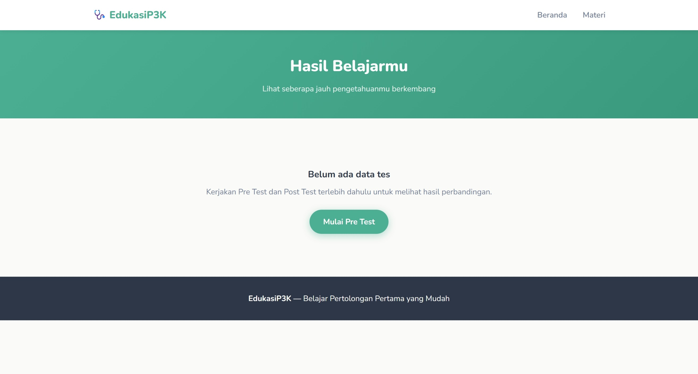

# 🩺 EdukasiP3K - Belajar Pertolongan Pertama

Platform edukasi interaktif untuk mempelajari **Pertolongan Pertama Pada Kecelakaan (P3K)** dengan cara yang menyenangkan dan terstruktur.

## Daftar Isi
- [Tentang Proyek](#tentang-proyek)
- [Fitur Utama](#fitur-utama)
- [Screenshots](#screenshots)
- [Struktur Proyek](#struktur-proyek)
- [Teknologi](#teknologi)
- [Cara Menggunakan](#cara-menggunakan)
- [Materi Pembelajaran](#materi-pembelajaran)
- [File dan Deskripsi](#file-dan-deskripsi)
- [Instalasi](#instalasi)

## Tentang Proyek

**EdukasiP3K** adalah aplikasi web pembelajaran interaktif yang dirancang untuk mengajarkan keterampilan pertolongan pertama kepada masyarakat umum. Aplikasi ini menggabungkan:
- **Materi pembelajaran** yang terstruktur
- **Pre-test** untuk mengukur pengetahuan awal
- **6 topik materi** lengkap dengan penjelasan
- **Post-test** untuk mengukur hasil pembelajaran
- **Sistem penilaian** otomatis

## Fitur Utama

**Fitur-fitur yang tersedia:**

1. **Halaman Beranda** - Navigasi utama dan pengenalan platform
2. **Pre-Test** - Tes awal sebelum mempelajari materi (5 soal)
3. **Materi Pembelajaran** - 6 topik penting tentang P3K:
   - Luka (Wound Care)
   - Mimisan (Nosebleed)
   - Tersedak (Choking)
   - CPR (Cardiopulmonary Resuscitation)
   - Patah Tulang (Fractures)
   - Luka Bakar (Burns)
4. **Post-Test** - Tes akhir setelah pembelajaran (5 soal)
5. **Halaman Hasil** - Menampilkan skor dan analisis pembelajaran
6. **Responsive Design** - Dapat diakses dari desktop dan mobile
7. **Navigasi Intuitif** - Menu yang mudah dipahami dan user-friendly
## Screenshots

### Halaman Beranda
Halaman utama dengan hero section yang menarik dan call-to-action button untuk memulai pembelajaran.



**Fitur:**
- Logo dan navigasi bar
- Hero section dengan headline yang menarik
- Floating cards untuk topik materi
- 6 topik pembelajaran preview
- CTA buttons: "Mulai Pre Test" dan "Lihat Materi Dulu"

---

### Halaman Pre Test
Halaman untuk mengikuti tes awal sebelum mempelajari materi.



**Fitur:**
- Progress bar untuk tracking soal
- Timer countdown
- Soal pilihan ganda dengan 4 opsi
- Navigasi Previous/Next
- Desain yang clean dan readable

---

### Halaman Materi
Halaman pembelajaran dengan 6 topik yang dapat dipilih melalui tab navigation.



**Fitur:**
- Tab navigation untuk 6 topik
- Ikon topik yang representatif
- Penjelasan materi yang terstruktur
- Step-by-step instructions
- Accordion untuk detail informasi

---

### Halaman Post Test
Halaman untuk mengikuti tes akhir setelah mempelajari materi.



**Fitur:**
- Interface serupa dengan Pre Test
- 10 soal pilihan ganda
- Timer dan progress tracking
- Validasi jawaban otomatis
- Tombol submit untuk mengirim jawaban

---

### Halaman Hasil
Halaman untuk melihat perbandingan hasil Pre Test vs Post Test.



**Fitur:**
- Perbandingan skor Pre Test & Post Test
- Visualisasi peningkatan pembelajaran
- Feedback positif atas peningkatan
- Tombol untuk mengulang pembelajaran
- Statistik pembelajaran

---
## Struktur Proyek

```
edukasip3k/
├── index.html          # Halaman utama (Beranda)
├── pretest.html        # Halaman pre-test
├── materi.html         # Halaman materi pembelajaran
├── posttest.html       # Halaman post-test
├── hasil.html          # Halaman hasil/skor
├── questions.js        # Data bank soal kuis
├── style.css           # Styling dan desain responsif
└── README.md           # Dokumentasi proyek ini
```

## Teknologi

Proyek ini dibangun dengan teknologi web dasar:

- **HTML5** - Struktur dan markup
- **CSS3** - Styling, layout, dan responsive design
- **JavaScript (Vanilla)** - Interaktivitas dan logika aplikasi
- **Google Fonts (Nunito)** - Font modern dan readable

## Cara Menggunakan

### 1. **Membuka Aplikasi**
   - Buka file `index.html` di browser favorit Anda
   - Atau jalankan melalui local server

### 2. **Alur Pembelajaran**
   ```
   Beranda → Pre-Test → Pelajari Materi → Post-Test → Lihat Hasil
   ```

### 3. **Mengikuti Pre-Test**
   - Klik tombol "Mulai Pre Test" di halaman beranda
   - Jawab 5 soal pilihan ganda
   - Lihat hasil pre-test sebelum mempelajari materi

### 4. **Mempelajari Materi**
   - Klik "Lihat Materi Dulu" atau menu "Materi"
   - Pilih topik dari 6 tab yang tersedia
   - Baca penjelasan lengkap setiap topik

### 5. **Mengikuti Post-Test**
   - Setelah selesai belajar, lanjut ke post-test
   - Jawab 5 soal yang sama untuk melihat peningkatan

### 6. **Melihat Hasil Pembelajaran**
   - Lihat perbandingan skor pre-test vs post-test
   - Analisis peningkatan pengetahuan

## Materi Pembelajaran

### Topik yang Dibahas (6 Materi):

| No | Topik | Deskripsi |
|----|-------|-----------|
| 1 | **Luka** | Penanganan luka terbuka, klasifikasi luka, dan pembersihan luka |
| 2 | **Mimisan** | Teknik menghentikan pendarahan hidung dan pencegahan |
| 3 | **Tersedak** | Maneuver Heimlich dan teknik penyelamatan tersedak |
| 4 | **CPR** | Prosedur resusitasi jantung paru dan rasio kompresi |
| 5 | **Patah Tulang** | Pengenalan jenis patah tulang dan teknik immobilisasi |
| 6 | **Luka Bakar** | Klasifikasi luka bakar dan penanganan pertolongan pertama |

### Contoh Soal:
- Langkah pertama saat menemukan orang pingsan
- Teknik menghentikan mimisan dengan benar
- Posisi tangan untuk Heimlich maneuver
- Rasio CPR yang benar untuk dewasa
- Cara membersihkan luka terbuka
- Klasifikasi dan penanganan luka bakar

## File dan Deskripsi

### `index.html`
Halaman utama/beranda aplikasi. Berisi:
- Navigasi navbar dengan logo dan menu
- Sektion hero dengan CTA (Call-to-Action)
- Tombol untuk mulai pre-test atau lihat materi
- Ilustrasi visual dengan floating cards

### `pretest.html`
Halaman untuk pre-test (tes awal). Fitur:
- Interface pertanyaan yang jelas
- Sistem jawaban pilihan ganda
- Modal konfirmasi sebelum submit
- Penyimpanan hasil di localStorage
- Navigasi ke materi pembelajaran

### `materi.html`
Halaman pembelajaran dengan 6 topik. Fitur:
- Tab-based navigation untuk 6 topik P3K
- Konten materi terstruktur dengan baik
- Accordion sections untuk informasi detail
- Tombol navigasi ke post-test

### `posttest.html`
Halaman post-test (tes akhir). Mirip dengan pretest.html:
- 5 soal yang sama dengan pre-test
- Penyimpanan hasil di localStorage
- Navigasi ke halaman hasil

### `hasil.html`
Halaman hasil pembelajaran. Menampilkan:
- Skor pre-test dan post-test
- Perbandingan visual dengan diagram/grafik
- Analisis peningkatan pembelajaran
- Saran feedback untuk pengguna
- Tombol untuk mengulang pembelajaran

### `questions.js`
Bank data soal dalam format JSON:
```javascript
{
  text: "Pertanyaan...",
  options: ["Opsi 1", "Opsi 2", "Opsi 3", "Opsi 4"],
  answer: 1  // Index jawaban yang benar (0-3)
}
```

### `style.css`
Styling keseluruhan aplikasi:
- **Variables**: Warna, spacing, font sizes
- **Layout**: Flexbox dan CSS Grid
- **Components**: Navbar, buttons, cards, modals
- **Responsive Design**: Media queries untuk mobile/tablet/desktop
- **Animations**: Transisi smooth dan hover effects
- **Color Scheme**: Kombinasi warna medis (biru, hijau) yang menenangkan

## Instalasi

### Metode 1: Buka Langsung di Browser
```bash
1. Ekstrak folder edukasip3k
2. Double-click file index.html
3. Browser secara otomatis membuka aplikasi
```

### Metode 2: Menggunakan Local Server
```bash
# Menggunakan Python 3
python -m http.server 8000

# Atau menggunakan Node.js (dengan http-server)
npx http-server

# Kemudian buka browser ke:
http://localhost:8000
```

### Metode 3: Deploy ke Server
```bash
1. Upload semua file ke hosting/server
2. Akses melalui domain Anda
```

## Catatan Teknis

- ✅ Kompatibel dengan semua browser modern (Chrome, Firefox, Safari, Edge)
- ✅ Responsive design untuk mobile, tablet, dan desktop
- ✅ Data disimpan di browser (localStorage) - tidak perlu database
- ✅ Tidak memerlukan backend server
- ✅ Load time cepat (semua file statis)

## Struktur Data localStorage

Aplikasi menyimpan data berikut di browser:
```javascript
{
  "preTestScore": 3,        // Skor pre-test (0-5)
  "postTestScore": 5,       // Skor post-test (0-5)
  "preTestAnswers": [...],  // Jawaban pre-test
  "postTestAnswers": [...], // Jawaban post-test
  "completedAt": "2024-..." // Waktu penyelesaian
}
```

## Pengembangan Lebih Lanjut

Ide untuk enhancement di masa depan:
- Progressive Web App (PWA) untuk offline mode
- Tema gelap (Dark Mode)
- Dashboard admin untuk tracking pengguna
- Sertifikat digital saat lulus
- Multi-bahasa support
- Database backend untuk menyimpan data pengguna
- Analytics dan reporting
- Video tutorial untuk setiap topik
- Sistem gamification dengan badges

## Lisensi dan Hak Cipta

Proyek ini dibuat untuk tujuan edukasi dan pembelajaran. Silakan gunakan, modifikasi, dan distribusikan sesuai kebutuhan Anda.

## Kontak dan Feedback

Jika Anda memiliki saran, masukan, atau menemukan bug, silakan hubungi developer.

---

**Dibuat dengan ❤️ untuk edukasi kesehatan masyarakat**
